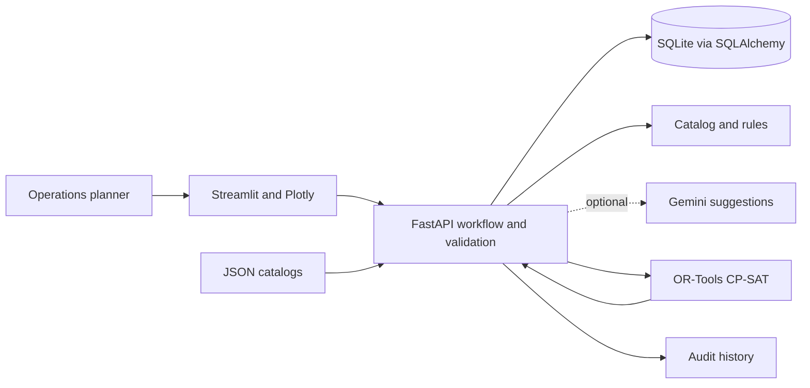

# Ngeebula · Rail maintenance planning prototype

Team Ngeebula's local prototype brings requests, engineer allocation, priority, scheduling, review, and progress into one operations dashboard.

## Run locally on Windows

Use Python 3.12. From the repository root:

```powershell
python -m venv .venv
.\.venv\Scripts\python.exe -m pip install -r requirements-lock.txt
```

Start the backend in one terminal:

```powershell
Set-Location backend
..\.venv\Scripts\python.exe -m uvicorn main:app --host 127.0.0.1 --port 8000
```

Start the frontend in another terminal:

```powershell
Set-Location frontend
..\.venv\Scripts\python.exe -m streamlit run app.py --server.address 127.0.0.1 --server.port 8501 --browser.gatherUsageStats false
```

Open the [dashboard](http://127.0.0.1:8501) or [interactive API docs](http://127.0.0.1:8000/docs). Stop each terminal's server with Ctrl+C. The frontend defaults to port 8000; change its URL in the sidebar or set `NGEEBULA_API_URL`.

The database is created at `backend/smrt_maintenance.db`. Fresh databases load the original `backend/engineers_db.json`, confirmed by the project owner as dummy data: 700 source records yield 697 engineers after duplicate-email removal. Existing databases are left intact. Local databases and credentials are excluded from Git. Enter requests through the dashboard. `jobs.json` is an example, not an automatically imported schedule.

See the [documentation index](docs/README.md) and [public GitHub preparation guide](docs/PUBLIC_RELEASE.md) for the repository layout, included data, publication checks and attribution.

## Render demo

[Deployment and hosting guide](docs/RENDER_DEPLOYMENT.md). The free Render service runs the public Streamlit dashboard and an internal FastAPI process. It starts with the original dummy roster and an empty job queue. Shared demo work resets on restart; this is not a persistent operational deployment.

## Daily workflow

Start in **Cockpit** to see work needing planning, approval, or attention. **Add work** opens a numbered train/infrastructure schematic with eight familiar assets and labelled buttons. Choose a repair, confirm its details, then enter location/deadline and review. **Describe another issue** retains free-text intake. Explicit catalog selections are preserved by the backend; Gemini is used only for unanchored free-text assessment.

Choose **See how a repair fits** for a read-only worked example. Three approved preventive jobs stay fixed while the real solver tries to insert a 45-minute corrective repair. Compare a feasible deadline with one that leaves no available slot. All example jobs, crew and durations are synthetic; the example creates no live record and makes no Gemini call.

Choose **Compare approaches & savings** for the three-way showcase: keep requested slots, first available slot, or joint planning with CP-SAT. Run the specialist-conflict, easy-fit and no-capacity situations. Each method receives the same jobs, crew and commitments; the worksheet proxy is not a benchmark of human planners. The timeline shows who works when, and unfinished work stays visible. **Estimated savings** separately compares planning effort, setup cost and running cost under editable assumptions, including negative returns. **Data & evidence** explains available LTA/SMRT information and what needs an operator source. **Explore & learn → Glossary** explains CP-SAT, constraints, first-fit, ROI and other terms in plain English.

This is planned corrective maintenance after operational assessment. Active incidents such as flooding or an unsafe door need the operator's incident process first. The app cannot determine whether a fault is safe to defer. See [the visual repair design plan](docs/VISUAL_REPAIR_PLAN.md) for scope and rationale.

1. **Create a request.** Choose the repair, then search for a station by name or code. Its line is filled in automatically; at an interchange, choose the serving line. For a train/depot worksite, use the separate manual path. Set the deadline in Singapore time and review the requirements.
2. **Review the crew.** Automatic allocation uses qualified, available engineers. Choose a team explicitly when required. Invalid selections receive an explanation.
3. **Generate a schedule.** Review preliminary location, qualification and deadline checks, then ask OR-Tools to check all time/crew conflicts together in the next complete 00:30–05:00 Singapore window. Passing preliminary checks does not guarantee feasibility.
4. **Adjust and approve.** Override priority, crew, or start time with a reason, then approve the reviewed plan. Invalid edits leave the saved plan intact.
5. **Track execution.** Record status and reasons for problems; consult alerts and audit history.
6. **Remove errors.** Delete eligible requests with confirmation and a reason. Audit history is retained; active work is protected.

The **About** page explains the problem, scope, workflow and algorithm choices, with Singapore news references and a data-provenance table. It works when the backend is offline. Pending requests remain visible before scheduling.

The workspace uses native Streamlit controls, summaries and tables. Search and filters help focus review; a Gantt chart shows scheduled work, with exact times and crew details in the table. Filtering is a viewing action: schedule generation still considers all eligible requests. Times are displayed in Singapore time.

If a saved request has the wrong location, open **Requests → Correct location**, review the suggested station/line, enter a reason, and save. Corrections clear the proposal, approval and fixed start time so the work can be replanned. Recognized station/line conflicts are rejected before creation and flagged on older records; existing work is never silently corrected. Station options are reconciled with a committed LTA snapshot, not a live network feed. [AGENTS.md](AGENTS.md) records the agreed UX and implementation rules; [the location review](docs/LOCATION_UX_REVIEW.md) explains this refinement.

The lookup contains information from **LTA Train Station Codes and Chinese Names**, accessed **17 September 2026**, under the [Singapore Open Data Licence 1.0](https://datamall.lta.gov.sg/content/datamall/en/SingaporeOpenDataLicence.html). [Source tables](https://datamall.lta.gov.sg/content/datamall/en/static-data.html). The January 2025 station snapshot has 213 codes; reconciliation corrects CE1 to Bayfront and adds DT4 Hume, while nine local-only entries remain unverified. Publication coverage does not establish 2026 service status. See [public-data research and refresh instructions](docs/PUBLIC_DATA_RESEARCH.md).

## What uses AI?

- **Rules and catalogs** provide offline assessment, matching work to skills and suggesting priority. Operators review and override the result.
- **OR-Tools CP-SAT** is mathematical constraint optimization, not trained predictive ML. It selects feasible times and crews.
- **Gemini** is optional GenAI for interpreting descriptions. Suggestions are validated; it cannot approve work or bypass constraints.

No API key is needed for the core workflow. Enter your key locally in the repository-root `.env` file as `GEMINI_API_KEY=...`; set `GEMINI_MODEL=gemini-3.8-flash`. The backend reads changes without a restart. Open **Utilities → AI setup**, refresh the snapshot, then choose **Test Gemini connection**. `.env` is ignored by Git; `.env.example` contains only the template. See [setup instructions](docs/GEMINI_SETUP.md). Backend environment variables take precedence; the Windows encrypted store remains an optional fallback. Keep the key out of the frontend, source control, and chat.

The backend falls back to rules when no key is present or model output fails validation. The separate AI test sends synthetic data and reports success only when a real Gemini response passes validation. It creates no job. A configured key alone does not prove that authentication, quota, model access or response validation succeeds; mocked tests do not prove live account access.

No additional predictive ML model is included: this repository has no training dataset or evaluated historical duration model. See [TECH_STACK.md](TECH_STACK.md) for the decision and stable technology contract.

## Architecture



## Verification

```powershell
.\.venv\Scripts\python.exe -m pytest -q
```

Tests use isolated databases and credential paths. [IMPLEMENTATION_PLAN.md](docs/plans/IMPLEMENTATION_PLAN.md) records the initial audit; [UX_REFINEMENT_PLAN.md](docs/plans/UX_REFINEMENT_PLAN.md) records the native UI pass; [COCKPIT_AND_AI_PLAN.md](docs/plans/COCKPIT_AND_AI_PLAN.md) records the subsequent simplification and secure AI setup; [TECH_STACK.md](TECH_STACK.md) records the architecture and design rationale; [VALIDATION.md](VALIDATION.md) records verified outcomes. [Research and data provenance](docs/RESEARCH_AND_DATA.md) separates news evidence from prototype assumptions.

## Prototype limits

The availability flag assumes an engineer is free for the full maintenance window. Travel, breaks, permits, line authorizations, and physical safety procedures are not modeled. No automatic 30-minute safety buffer is claimed. Planner names are attribution, not authentication. Audit history is retained by the API but is not tamper-proof against direct database changes. This is a planning prototype, not an operational authorization system.

The original crew roster is dummy data, as confirmed by the project owner; maintenance catalog provenance remains unverified. The attributed LTA snapshot supplies station-reference evidence, not live operations. Example jobs and demonstrations are synthetic. The fixed 00:30–05:00 SGT planning window is a model assumption, not a claim of usable work time in actual operations. This prototype is not endorsed by SMRT or LTA.

Original repository: [notjerrygoh/ngeebula](https://github.com/notjerrygoh/ngeebula). The supplied README contained this GitHub link and no Google document link.
