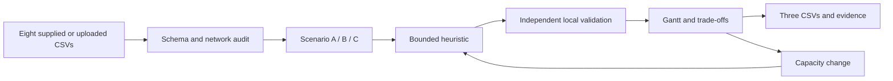

# Ngeebula · Engineering access planning

A React cockpit for **NebulaX Problem Statement 1 (PS1)**: fit every activity into a constrained railway engineering-access programme, then compare protecting supply, protecting dates, or balancing both. A separate maintenance workflow retains requests, qualified crew allocation, proposals, approval and execution.

[Open the app](https://ngeebula-ui-ux.onrender.com/) · [Pinned problem statement](https://github.com/aochinwen/NebulaX-Hackathon-ProblemStatement/tree/16526c02579c7f37e54eaaa42a4cc6d4ceb19994/PS1) · [Documentation](docs/README.md)

## Exact supplied dataset

The app loads the **same eight CSVs** in the public PS1 pack, identified by the project owner as SMRT-supplied. Files are preserved byte-for-byte at commit `16526c02579c7f37e54eaaa42a4cc6d4ceb19994`, with SHA-256 hashes in [the manifest](data/ps1/MANIFEST.json).

| Measure | Supplied instance |
|---|---:|
| Lines / station records / sectors | 2 / 20 / 18 |
| Locations | 76 |
| Contracts / activities | 14 / 54 |
| Required work units | 192 |
| Nominal horizon | 30 weeks, starting 4 January 2027 |

Alpha/Beta and H01/H02 remain the exact challenge identifiers. The public source does not establish whether these records reproduce live operations. The dummy crew roster, LTA station reference and invented repair examples belong to the separate maintenance workflow. [Dataset audit](docs/PS1_DATA_AUDIT.md).

## Workflow

1. **Overview:** inspect demand counts and the supplied network.
2. **Plan access:** choose A (strict supply, no ECLO), B (strict planned dates), or C (limited extra supply and bounded ECLO).
3. **Schedule:** review the weekly Gantt, exact rows, delays and additional access. Filters change the view, not the demand being scheduled.
4. **Export:** download the three required CSVs in a ZIP; download local validation and physical-night evidence separately.
5. **What-if:** reduce capacity at a location/week and compare the resulting changes.
6. **Data & imports:** validate and load another instance of the eight named CSVs individually or in a ZIP.



Full workload, earliest starts, spans, buffers, Live mirroring/crossover, legal co-sharing, workfronts and weekly allocations are checked. The organisers' **official trackaccess validator is not in the linked pack**. Local checks are not official certification or operational approval. The planner returns a best found plan without proving global optimality. Runs beyond the nominal horizon explicitly assume flat nominal capacities continue; this interpretation needs organiser confirmation. [Rule implementation and limits](docs/PS1_BACKEND_GAP_AUDIT.md).

Committed candidate submissions: [Scenario A](submissions/ps1/A/), [Scenario B](submissions/ps1/B/), [Scenario C](submissions/ps1/C/), with [separate validation evidence](submissions/ps1/reports/). Reproduce them with `python scripts/generate_ps1_submission.py`. Runtime incumbents can differ with the time budget and host speed.

## Run locally

Use Python 3.12 and Node.js 22.12+ (Node 24 tested), from the root:

```powershell
python -m venv .venv
.\.venv\Scripts\python.exe -m pip install -r requirements-lock.txt
npm --prefix web ci
npm --prefix web run build
.\.venv\Scripts\python.exe -m uvicorn backend.main:app --host 127.0.0.1 --port 8000
```

Open [React](http://127.0.0.1:8000/) or [API docs](http://127.0.0.1:8000/docs). For development, run `npm --prefix web run dev` in a second terminal; Vite proxies the API to port 8000. Restart the API after backend edits or the first frontend build.

No Gemini key is needed for PS1. Optional Gemini interprets unanchored maintenance descriptions only. Put `GEMINI_API_KEY` in the ignored root `.env`, using `.env.example` as a template. Never use a `VITE_` variable for a secret. [Gemini setup](docs/GEMINI_SETUP.md). PS1 inputs are never sent to Gemini implicitly.

## Maintenance and legacy features

**Work requests** provides eight repair shortcuts, station-first line selection, proposals, approval, execution and audit through the existing API. Explicit catalog choices bypass AI. Approved/fixed work remains committed in the crew scheduler. Active incidents require operator procedures before planned corrective work is entered.

Fresh SQLite databases load the original dummy roster: 700 source records, 697 after duplicate-email removal. Existing databases are preserved. `frontend/` retains the historical Streamlit interface and advanced legacy views; **React in web/ is the deployed primary UI**. The earlier [stakeholder video](video/README.md) shows the legacy interface, not this PS1 release.

## Verify and deploy

```powershell
.\.venv\Scripts\python.exe -m pytest -q
npm --prefix web run build
.\.venv\Scripts\python.exe scripts/audit_public_release.py
```

[Validation](VALIDATION.md) · [Technology report](TECH_STACK.md) · [Migration plan](docs/plans/PS1_REACT_MIGRATION.md) · [Render guide](docs/RENDER_DEPLOYMENT.md).

Render serves React and FastAPI from one process/origin. This is a shared public demo without authentication. Imported datasets and runs expire from bounded memory; SQLite work/audits can disappear on restart. Use dummy data and download results. No paid resources are required.

## Attribution and limits

The PS1 pack, commit and sample outputs remain attributed and unchanged. Upstream supplies no explicit dataset/software reuse licence; inclusion follows the project owner's publication request and grants no downstream rights. LTA station references have separate [attribution and licence terms](docs/PUBLIC_DATA_RESEARCH.md). [Singapore news](docs/RESEARCH_AND_DATA.md) supports the problem context, not measured savings or planner certification.

Original application: [notjerrygoh/ngeebula](https://github.com/notjerrygoh/ngeebula). This prototype is not endorsed by SMRT or LTA and cannot grant engineering access or certify safe operations.
