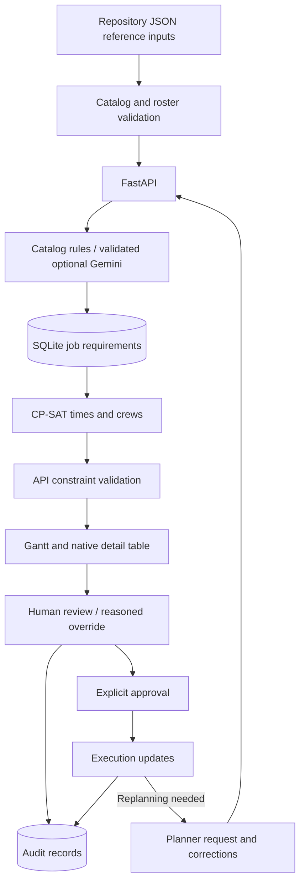

# Architecture and technology decision record

## Stack contract

This implementation stays with the repository's existing architecture. Feature work must not introduce a replacement JavaScript frontend, external database, paid solver service, or additional model framework without an explicit architecture decision.

| Layer | Technology | Responsibility |
|---|---|---|
| Runtime | Python 3.12 | Backend, frontend, and local tests |
| API | FastAPI, Uvicorn, Pydantic | HTTP routes and validated request contracts |
| Persistence | SQLAlchemy 2, SQLite | Jobs, skill-qualified engineers, approvals, audit records |
| Reference data | JSON catalogs plus versioned LTA snapshot | Attributed station reconciliation; demo maintenance activities and initial engineer roster |
| Scheduling | Google OR-Tools CP-SAT | Select times and qualified crews under explicit constraints |
| Optional GenAI | Google GenAI Python SDK, Gemini | Interpret maintenance descriptions; suggestions are validated |
| Local configuration | python-dotenv; ignored root `.env`; optional Windows DPAPI fallback | Backend-only credential loading with environment precedence; `.env` edits need no restart |
| Operator UI | Native Streamlit, Plotly, pandas | Labeled controls, request queue, Gantt timeline, alerts, audit, offline About |
| Verification | pytest, FastAPI TestClient, Streamlit AppTest | Isolated backend and user-journey regression tests |

Optional reference refresh uses pandas with xlrd 2.0.2 and openpyxl 3.1.5 to read LTA's published spreadsheets. These are build-time import tools; the application serves committed JSON and makes no runtime DataMall call. The main application stack is unchanged.

## Comparison, estimated value and preliminary checks

`backend/planning_comparison.py` compares three deterministic methods against identical synthetic inputs. The requested-slots proxy checks input order at requested times; priority-first-fit sorts by priority, deadline and ID, scans minute slots, and chooses qualified free crew without backtracking. Joint planning calls the existing CP-SAT adapter with its all-or-none policy. A partial sequential result is explicitly incomplete; UNKNOWN and error are not relabelled infeasible. Scenarios include a specialist conflict, an easy agreement case and a no-capacity case. No database or model-provider call is involved.

`POST /schedule/compare` exposes schedules, unplaced work, measured synthetic counts and solver status/runtime. `POST /schedule/roi` validates finite bounded assumptions and calculates planning-effort value separately. Annual effort is monthly runs × 12 × minutes / 60; annual net benefit deducts incremental running cost from labour savings; first-year benefit also deducts incremental setup cost. ROI uses positive incremental setup cost as denominator. Negative benefit is retained; payback is undefined when annual benefit is not positive. This is a constant-use, undiscounted illustration, not measured operational ROI.

`GET /schedule/readiness` reports obvious candidate location, qualifications, fixed-crew and deadline blockers without solving or writing. It does not detect every joint time/resource conflict and cannot replace proposal validation. The UI makes this distinction explicit and links blockers to request review.

`frontend/comparison_page.py` presents a crew-by-method Gantt and separate cost comparison; `frontend/glossary.py` provides offline definitions/help; `frontend/data_evidence.py` distinguishes public context from operator-only resources. Explore & learn is separate from operational utilities. The LTA importer records source URLs, dates and SHA-256 hashes; `backend/lta_reference.py` reconciles names/lines, retains correction metadata, appends official missing codes and labels unsupported local entries. Saved jobs remain untouched.

`requirements-lock.txt` records the installed versions verified on Windows/Python 3.12. The component requirements express the direct dependencies. Keep the lock updated only alongside verification.

## Data and time

Fresh SQLite databases seed from the original `backend/engineers_db.json`. The project owner confirmed on 17 September 2026 that these 700 source records are dummy data; duplicate-email removal yields 697 engineers. Existing database records are not changed. This is a demonstration roster, not operational staffing evidence. `scripts/audit_public_release.py` checks Git publication candidates for private paths and common credential formats without reading ignored files.

The SQLite file is local to `backend/` unless `DATABASE_URL` is configured. API responses must carry an explicit UTC offset; SQLite naive timestamps are treated as UTC. Operators enter and view Singapore time (UTC+08:00). Scheduling targets the next complete 00:30–05:00 Singapore maintenance window.

The API owns validation and mutations. The frontend must not bypass it by writing SQLite or JSON files. The solver calculates a candidate; the API validates and persists it transactionally. Audit entries survive job deletion. A planner identity entered in a form is attribution, not authenticated identity.

## Optimization, GenAI, and ML

CP-SAT is mathematical constraint optimization, not a trained predictive ML model. It is appropriate for combinations of discrete crews and time slots with hard constraints; see [Google's constraint optimization documentation](https://developers.google.com/optimization/cp).

Gemini is optional generative AI. Credentials are read only by the backend, from the root `.env`, optional Windows DPAPI store or the `GEMINI_API_KEY` environment override. The default is [Gemini 3.8 Flash](https://ai.google.dev/gemini-api/docs/models/gemini-3.8-flash), model ID `gemini-3.8-flash`, verified against Google's September 2026 documentation. `GEMINI_MODEL` can override it. Model output must be validated against the domain and may never bypass staffing or scheduling checks. Without a key or when the service fails, catalog/rule-based assessment remains available. Google's SDK supports [structured output schemas](https://ai.google.dev/gemini-api/docs/structured-output); structured syntax still needs domain validation.

No predictive ML model is added: this repository provides no historical repair outcomes, training pipeline, or held-out evaluation data. A future duration-estimation model would need actual durations, task categories, conditions, and evaluation of error and uncertainty before influencing planning. Adding an unvalidated model now would not improve the requested workflow.

## Prototype boundaries

The engineer availability flag represents availability throughout a maintenance window. The supplied roster's free-text historical project list does not encode usable shift times. Travel, breaks, physical access permits, line authorizations, and operating procedures require additional structured inputs; this local prototype does not certify them. Catalog skills and durations need planner review. The UI must state actual checks and must not claim unmodeled safety buffers or full operational compliance.

Each assigned engineer must have every required skill, using case-insensitive exact skill names. This is deliberately stricter than collective team skill coverage. The supplied catalog and roster use inconsistent terminology: many activities have no complete qualified crew under this rule. The API exposes qualified counts and keeps a request with a visible shortage when allocation is impossible. The planner can review requirements using catalog and roster skills; the software does not invent qualification equivalences.

Priority weights (Urgent 4, High 3, Medium 2, Low 1) penalize displacement from original starts in the CP-SAT objective. Priority is not a hard guarantee of execution order. Explicit crew selections and times become commitments; generation preserves them. Approval remains a separate human action.

SQLite audit records are append-only through this API; they are not tamper-proof against direct database access. Authentication, role-based authorization, enterprise audit retention, and production deployment are separate work. Local services bind to loopback for this demonstration.

## UI and explanation decisions — 17 September 2026

| Decision | Rationale | Trade-off / boundary |
|---|---|---|
| Native Streamlit structure and theme | Built-in controls provide consistent labels, state, keyboard behavior and responsive layouts; less custom HTML to maintain | Streamlit reruns require deliberate state management; native widgets do not by themselves establish accessibility compliance |
| Task-ordered workspace | Requests → plan and approval → execution matches the planner's sequence | Alerts and audit remain separate reference views |
| Progressive disclosure | Overrides, manual requirements and connection settings are secondary to the normal workflow | Advanced actions must retain descriptive labels and remain discoverable |
| Gantt plus schedule table | Bar position and length communicate timing and duration; the table gives exact values and crew details | Empty time on a chart is not proof of usable capacity: travel, mobilisation and possessions are unmodeled |
| Record-ID selection | The selected job resolves to the newest API record on each rerun | Editor fields reset when the saved record changes; typed changes otherwise remain local until submitted |
| Offline About | Purpose, sources and assumptions remain readable during a backend outage | News is a dated reference, not a live feed |
| Visible data provenance | Readers can distinguish repository examples, unverified reference inputs and operator-entered records | No official operational source or synthetic generator is inferred merely from realistic-looking names |

### Algorithm choice

CP-SAT jointly selects discrete start times and crew membership while enforcing the modeled hard constraints. A greedy earliest-start or priority-only ordering could miss a feasible combination when jobs compete for both location and qualified engineers. The current weighted displacement objective favors keeping existing starts stable, with a larger penalty for shifting higher-priority jobs. For an unscheduled job, the reference start is the engineering-window start. This does **not** maximize completed work, prove minimum disruption, or guarantee that urgent work always runs first. Infeasible inputs are surfaced for planner correction rather than silently dropped.

Catalog rules are inspectable and keep the core workflow usable without an external service. Optional Gemini helps interpret free text, but suggestions must pass the same domain checks; neither it nor the solver approves execution. Predictive ML would require historical measured outcomes and held-out evaluation that are absent from this repository.

### Data and decision flow

The prototype fixes its planning window at 00:30–05:00 SGT. This is an implementation assumption, not a claim that operators have 4.5 net productive hours. Supplied source provenance, data-quality findings and dated Singapore context are recorded in [RESEARCH_AND_DATA.md](docs/RESEARCH_AND_DATA.md). The UI audit and acceptance criteria are in [UX_REFINEMENT_PLAN.md](docs/plans/UX_REFINEMENT_PLAN.md).

## Cockpit and AI setup refinement

User feedback showed that replacing HTML with native widgets had not sufficiently reduced decision load. The revised default is a maintenance-chief cockpit: readiness counts, work that needs attention, and a direct Add work action. The request flow progressively asks for a description, location/deadline, and confirmation. Full catalog browsing and manual crew/requirement controls are secondary. An explicit draft object preserves data when Streamlit removes widgets from previous steps.

Gemini setup separates credential presence from operational verification. At the user's request, the primary local setup is a Git-ignored root `.env` file, read on each request with interpolation disabled. Environment values take precedence; the optional Windows DPAPI store is a credential fallback. The browser neither submits nor receives the key. `.env` is plaintext local configuration, not encrypted storage; avoid sharing it in repository archives. The retained DPAPI helper protects its optional stored value at rest for the Windows user, but does not isolate it from other processes running as that user.

The AI connection test sends synthetic maintenance text through the same provider-call and catalog-validation path used for assessment. It does not write a repair job. A successful rules fallback is **not** a successful Gemini test: missing configuration, provider failure, invalid model output, and valid Gemini output are separate outcomes. Tests isolate both the environment and the credential-file path so they cannot consume an operator's real key.

See [GEMINI_SETUP.md](docs/GEMINI_SETUP.md) for local setup and [COCKPIT_AND_AI_PLAN.md](docs/plans/COCKPIT_AND_AI_PLAN.md) for scope and acceptance criteria.

## Visual repair intake and schedule insertion

Location entry is a native Streamlit station-first component (`frontend/location_picker.py`). The backend exposes normalized station names, codes and serving lines from `stations_db.json` through `/catalog/`. Single-line stations resolve automatically; interchanges require an explicit serving-line choice. Train/depot work uses a separate line and operational-identifier path because this prototype has no verified fleet/depot registry. This is deterministic reference lookup, not a Gemini inference.

The API validates explicit codes and recognized station names before assessment or writes, preferring longer names such as Woodlands North. Location corrections are limited to Not started requests, require a reason, retain before/after audit data, and clear scheduled times, approval and time locks. Legacy conflicts expose `location_warning` and block planning/approval until corrected. Reference entries are supplied repository data, not verified current service availability.

The entry step now uses eight curated asset shortcuts, a local SVG schematic and native Streamlit buttons. `frontend/asset_picker.py` maps each shortcut to an exact catalog pair. The SVG is a recognition aid; it does not imply asset telemetry, geographic accuracy or a digital twin. A 2D guide avoids camera controls, occlusion and a new rendering framework. Text buttons provide equivalent selection without interpreting the image.

`JobInput.catalog_category` and `catalog_activity` are optional together. The API validates the exact pair, preserves its classification and full required skill set, and bypasses Gemini for that explicit choice. Unanchored descriptions retain optional Gemini/rules assessment. Selecting a different asset clears previous manual requirements and crew, while preserving location/deadline and priority for review.

`POST /schedule/insertion-demo` is a read-only synthetic example using the same CP-SAT adapter as real planning. Three approved jobs share two qualified engineers and a maintenance bay. A 45-minute repair either fits a gap or fails a tighter deadline. Both cases keep the baseline, duration and crew constant; no result is saved or applied. `frontend/insertion_visual.py` renders a before/after Gantt and exact-times table. Synthetic durations are illustrative, not recommendations for real repairs.

The live solver already preserves approved and time-locked work. Other unapproved proposals may move, and proposals require human approval. Train/depot tasks use a simplified location/time model: rolling-stock availability, depot routing, spare parts and operational release are outside scope. See [VISUAL_REPAIR_PLAN.md](docs/VISUAL_REPAIR_PLAN.md).

## Render deployment

A single Python 3.12 web service runs `scripts/start_render.py`: it waits for the loopback-only FastAPI process, starts Streamlit on Render's `PORT`, and terminates both on shutdown or child failure. The frontend uses a fixed internal API address in hosted mode. `render.yaml` defines the free Singapore service and health check. Credentials are Render environment variables, not committed files; the deployment API key is never copied to the app. SQLite is ephemeral and shared between demo visitors. See [hosting details](docs/RENDER_DEPLOYMENT.md).
