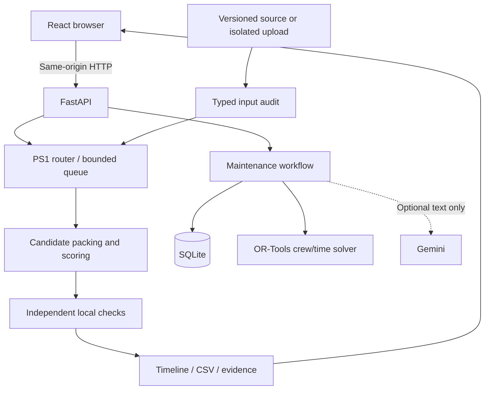

# Architecture and technology report

## Current stack

The user's 17 September 2026 architecture decision replaces Streamlit with React as the deployed frontend. FastAPI is retained, with PS1 separated from the existing crew/repair domain.

| Layer | Technology | Responsibility |
|---|---|---|
| Browser | React 19, TypeScript, React Router, Lucide | Task navigation, labelled network, weekly Gantt, forms |
| Build | Vite; exact npm lock | Compiled static assets in web/dist |
| API/runtime | Python 3.12, FastAPI, Uvicorn | Same-origin API and SPA, one worker |
| PS1 input | CSV, frozen dataclasses, Decimal | Typed input audit and immutable capacity overrides |
| PS1 planning | Bounded constructive heuristic | Candidate policies, complete plans, best found objective |
| PS1 checks | Independent validator plus physical-night witness | Recheck exported rows and spatial/temporal constraints |
| PS1 session state | Bounded memory; one background worker | Isolated imports and asynchronous runs |
| Maintenance planning | OR-Tools CP-SAT | Joint crew/time decisions |
| Maintenance records | SQLAlchemy 2, SQLite | Requests, approval, status and audit |
| Optional GenAI | Google GenAI SDK | Maintenance text suggestions validated against catalog/domain |
| Legacy UI | Streamlit, Plotly, pandas | Historical interface; not launched in production |
| Verification | pytest, TestClient, TypeScript and browser checks | Domain, integration, publication and visual evidence |

`web/package-lock.json` and `requirements-lock.txt` pin the tested dependencies. Legacy Python UI dependencies remain for compatibility. Node is required at build/development time; Python serves the production bundle.

## Why two schedulers?

PS1 allocates **weeks and possessions**, with spatial buffers, co-sharing and scenario-specific elasticity. The original CP-SAT model allocates **engineers and minute-level repair windows**. Treating that model's outputs as a PS1 answer would omit essential constraints. The new module preserves the supplied network and avoids inventing crew data.

The PS1 heuristic explores candidate orderings and ECLO choices within a time budget. It selects the lowest-scored complete locally valid incumbent. It proves neither global optimality nor infeasibility. An incomplete search returns an unresolved result with export disabled; demand is never silently dropped.

The independent validator recalculates workload, footprints, mixes, supply, completion and scores. Co-share labels are scoped by location/week, as in the official sample. A supplementary physical-night witness enables generated schedules' closure checks. The three CSVs alone cannot reconstruct that witness, so CSV-only checks report partial coverage. The referenced official validator is unavailable in the linked pack.

See [backend audit](docs/PS1_BACKEND_GAP_AUDIT.md), [acceptance review](docs/PS1_ACCEPTANCE_REVIEW.md) and [data audit](docs/PS1_DATA_AUDIT.md). Continuing flat capacities beyond the nominal horizon and the absence of a defined predecessor rule remain explicit interpretations, not certified operator rules.

## UI rationale

| Choice | Rationale / boundary |
|---|---|
| Overview → policy → schedule → export | Matches the PS1 decision sequence with little initial input |
| Three scenario cards | Makes rigid constraints and permitted trade-offs visible |
| Exact two-line schematic | Recognisable locations without a false live-map/digital-twin claim |
| Weekly Gantt and exact table | Sequence visibility plus precise identifiers/values |
| Progressive disclosure | Assumptions and capacity changes stay available without dominating |
| Eight repair shortcuts | Reduces catalog search while retaining review |
| Station-first maintenance location | Derives single serving lines and asks explicitly at interchanges |
| Native controls and focus styles | Keyboard and narrow-screen support; no formal accessibility certification |

Comparison/ROI/insertion examples remain backend and legacy-UI capabilities. Their synthetic jobs and editable assumptions are not measured savings. React focuses on PS1 and the essential maintenance lifecycle.

## Data and state boundaries

- Supplied PS1 files are immutable and hashed. Uploads cannot rewrite them or saved maintenance jobs.
- Imports accept the eight named UTF-8 CSVs/ZIP, with size/schema/domain limits and no arbitrary filesystem extraction.
- The shared demo retains at most eight datasets and 32 runs, with one worker and four queued/running requests. Temporary IDs are not authenticated accounts.
- React receives no API keys. Backend environment variables override ignored local .env values. PS1 never invokes Gemini; the Render administration key stays local.
- SQLite audits survive ordinary job deletion but are not tamper-proof. Planner names are attribution, not authentication.
- Maintenance times are offset-aware and displayed in Singapore time. Its 00:30–05:00 window is a prototype assumption; PS1 uses the supplied week calendar.
- Durable storage, authorisation, operational permits and real-time dispatch remain outside the demo.

## Deployment and separate tooling

`scripts/build_render.py` installs Python dependencies, runs npm ci and builds React. `scripts/start_render.py` verifies the bundle and replaces itself with one Uvicorn process on Render's PORT. FastAPI serves the SPA, assets, API and /healthz. The old Streamlit health path is retained only for rollout compatibility.

This replaces the previous dual-process deployment. The API now intentionally shares the public browser origin. Free hosting has ephemeral state. [Render guide](docs/RENDER_DEPLOYMENT.md).

The separate Remotion project in video/ produces the earlier legacy-UI walkthrough. It is excluded from the application build and does not demonstrate this PS1 release.
