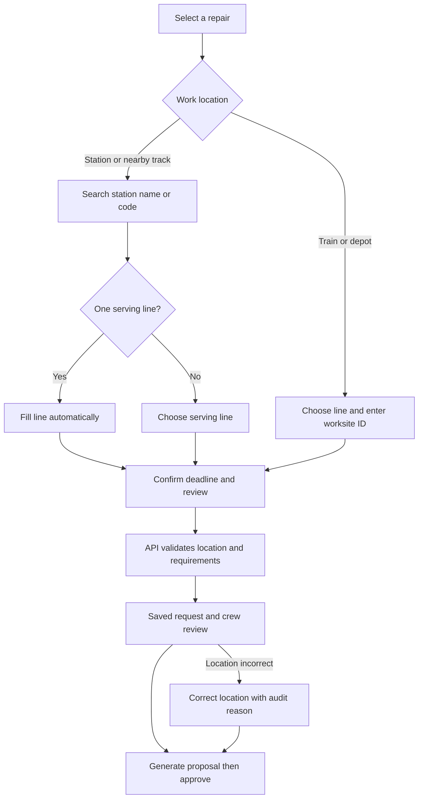

# Station-first location review

The user-created train-door repair paired `clementi` with North–South Line. The prior form defaulted to the first rail line and accepted location as unrelated free text. That required unnecessary network knowledge and allowed a contradictory record. The created-request view also promised that the scheduler would find qualified crew despite an existing shortage.

## Implemented decisions

- Keep the eight visual asset choices and short guided request flow.
- Search station names and codes in one native selectbox. Clementi resolves to EW23 / East–West Line; no line needs typing. Interchanges require the relevant serving line.
- Separate train/depot identifiers from stations. Do not invent a fleet or depot lookup. Optional area/asset details preserve operational specificity.
- Preserve draft entries when navigating Back/Next. Clear dependent serving-line and area values when the station changes.
- Validate station/line consistency on the API as well as the UI. Unknown manual worksite text remains allowed; recognized contradictory station names or codes are rejected.
- Flag legacy conflicts in the cockpit and request summary. Open Correct location with a suggestion, require an audit reason and explicit save, then clear affected proposal/approval/time locks. Do not rewrite existing work silently.
- State crew shortages and required skills plainly. Do not weaken qualifications to make the example appear schedulable.

Station choices are normalized from `backend/stations_db.json` (221 station-line entries at this review). This supplied reference is not a real-time network service feed. The UI makes a deterministic lookup; no Gemini key or model call is required for station selection. See VALIDATION.md for the integration results and AGENTS.md for continuing implementation rules.
