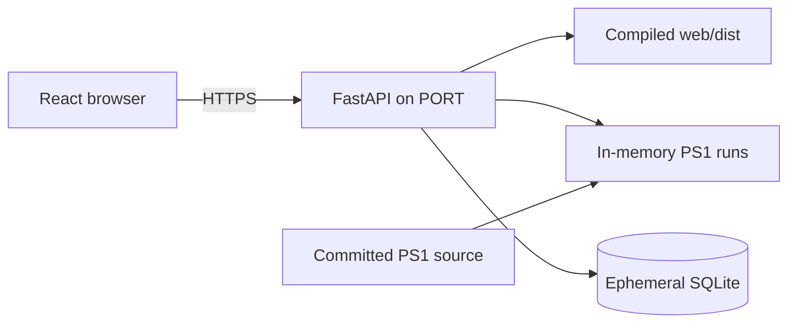

# Render deployment

[Public React app](https://ngeebula-ui-ux.onrender.com/) · [GitHub source](https://github.com/simonraj79/ngeebula_ui_ux) · [Existing service dashboard](https://dashboard.render.com/web/srv-dalupmlbedkc738crblg)

| Setting | Value |
|---|---|
| Runtime / region / plan | Python 3.12 / Singapore / free |
| Source | main |
| Build | python scripts/build_render.py |
| Start | python scripts/start_render.py |
| Health | /healthz |
| Instances/workers | One / one |

Render native builds include Node/npm. The build installs pinned Python packages, runs npm ci under web/, then TypeScript/Vite. Streamlit is not launched. The API and SPA share the public origin; unknown API/file paths return 404.

The existing service was created directly. render.yaml documents equivalent configuration but does not automatically update this service's dashboard settings. Update the existing build/health settings when migrating; do not create a duplicate.

## Credentials and state

Optional GEMINI_API_KEY and GEMINI_MODEL stay in server environment settings and are only used by maintenance text assessment. PS1 needs no key. Never put secrets in VITE_ variables, source or CSVs. RENDER_API_KEY is local administration configuration, not an app environment variable.

This public demo has shared jobs and no login. Use dummy inputs. Imported datasets and runs are bounded in-memory state and disappear on restart or eviction. Maintenance SQLite and audits are ephemeral too. The original dummy roster seeds fresh databases; local databases/jobs are never uploaded. Download results before leaving.

Free services can sleep and take time to wake. [Render documentation](https://render.com/docs/free). No paid service or disk is provisioned.

## Release check

1. Run pytest, the React build and scripts/audit_public_release.py.
2. Inspect staging; exclude credentials, databases, node_modules, generated video and runtime screenshots.
3. Push to main and inspect the exact commit in Render's deployment.
4. Confirm /healthz, /ps1/dataset and browser routes.
5. Generate a complete locally checked plan; inspect the three-file ZIP and separate validation JSON.
6. Check desktop/narrow React screens without mutating public maintenance jobs.

A successful push alone does not establish a successful deployment.
