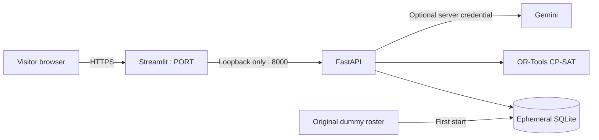

# Render demo deployment

The [GitHub repository](https://github.com/simonraj79/ngeebula_ui_ux) includes a `render.yaml` configuration for one **free Python web service in Singapore**. `.python-version` selects Python 3.12; `requirements-lock.txt` pins the tested packages.

## Runtime

- Build: `pip install -r requirements-lock.txt`.
- Start: `python scripts/start_render.py`.
- Health check: `/_stcore/health`.
- The launcher waits for FastAPI before starting Streamlit, monitors both children and stops both on shutdown. FastAPI binds only to `127.0.0.1`; the dashboard is the public entry point.
- Hosted mode fixes the backend URL and labels the shared, temporary demo state. Local development keeps the existing connection settings.
- Only one instance is supported with SQLite. The database is created from the original dummy roster; local jobs and local database files are never uploaded.

## Credentials

Set `GEMINI_API_KEY` in the Render service's Environment settings. `GEMINI_MODEL` defaults to `gemini-3.8-flash`. The app's core planning works without Gemini. Never commit `.env` or Streamlit secrets. A local `RENDER_API_KEY` is used only for deployment administration and must not be placed in the app environment.

The public demonstration has shared jobs and no login; planner names provide attribution only. Visitors can exercise the optional AI feature when a Gemini key is configured, so provider usage applies. Use only dummy data.

## Availability and persistence

Render's [free service documentation](https://render.com/docs/free) states that free instances sleep when idle and have an ephemeral filesystem. Expect a delayed first visit after inactivity. Jobs, changes and audit entries can disappear on restart/redeploy. Durable operational use requires a separately chosen persistent storage and authentication design; no paid resources are provisioned by this configuration.

## Deploying or updating

For the existing service, push reviewed commits to `main`; auto-deploy builds the latest commit. Inspect the build and deploy status before assuming the new version is live.

For a separate installation, use the [Render Blueprint setup](https://dashboard.render.com/blueprint/new?repo=https://github.com/simonraj79/ngeebula_ui_ux), supply the optional Gemini key, and apply. Do not create a second Blueprint installation merely to update an existing directly created service.

Verify the service reports **live**, `/_stcore/health` returns 200, the cockpit loads the roster, and Compare approaches returns a complete joint-planning example. Tests use isolated databases and credentials. Publication checks are documented in [PUBLIC_RELEASE.md](PUBLIC_RELEASE.md).
