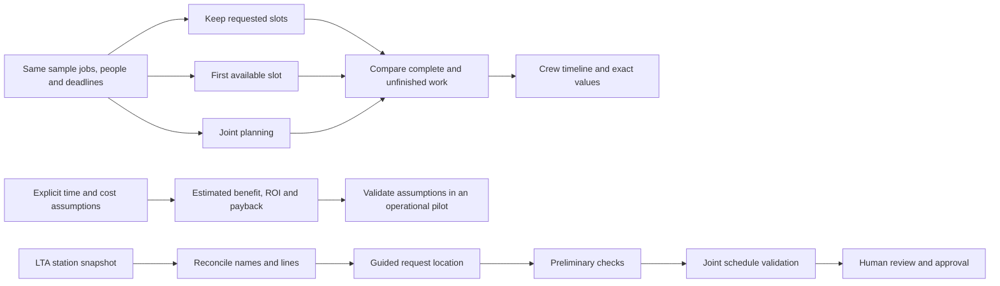

# Planning showcase and evidence

The problem remains fitting late corrective repairs around approved preventive commitments in a limited maintenance window. The application supports a planner's decision after operational assessment; it does not dispatch incident response or grant safe access.

## Implemented experience

The cockpit links directly to the repair insertion example and **Compare approaches & savings**. The comparison has three views: **Compare plans**, **Estimated savings**, and **Data & evidence**. A scenario selector and one action reveal the outcomes; detailed schedules, methods and financial assumptions are secondary. The planning workspace separates **Schedule & issues** from **Review & approve** so the timeline and editing controls do not become one long form. The glossary is searchable and available offline.

## Fair comparison contract

| Approach | Decision rule | Interpretation |
|---|---|---|
| Requested slots | Accept requested times in input order with the first qualified free crew | A scripted worksheet proxy; not observed human performance |
| First available slot | Priority, deadline and ID order; first valid minute and crew; no backtracking | A transparent simple heuristic, not every possible heuristic |
| Joint planning | Existing CP-SAT adapter checks all jobs together, minimizes weighted start movement | Same all-or-none policy as live planning; no silent omission |

All methods retain identical fixed preventive work. The specialist example places 1/2 new jobs with either sequential approach and 2/2 with joint planning. The easy example places 2/2 with all methods. The impossible example cannot produce a complete plan; partial sequential outputs remain visibly incomplete, while CP-SAT returns infeasible without a partial proposal. UNKNOWN and errors are never called infeasible. These are constructed examples, not evidence of typical operational superiority.

## Value, without invented performance

The calculator compares joint planning against either alternative. Inputs cover planning runs/month, total staff minutes/run, hourly labour cost, setup cost and monthly operating cost. The default assumptions produce a positive first-year result against the requested-slots baseline and a negative first-year result against first-fit. Users can change the assumptions; values persist when switching views.

Annual hours = runs/month × 12 × minutes/run ÷ 60. Annual net benefit = labour savings − incremental running cost. First-year net benefit subtracts incremental setup cost. First-year ROI divides that net benefit by positive incremental setup cost. Payback requires both a positive setup premium and positive annual net benefit. Zero setup premium is shown explicitly; negative results are retained. Time released is not automatically cash saved. The model excludes tax, financing and discounting, and does not price disruption, safety, reliability or maintenance quality.

## Requirement-to-evidence audit

| Requirement | Authoritative implementation and verification |
|---|---|
| Visual showcase against two alternatives | `comparison_page.py`, identical-input methods in `planning_comparison.py`; three scenario API/UI journeys; desktop and 375-pixel browser inspection |
| ROI explained with both baselines | `/schedule/roi`, cost chart, assumptions/formulas; validation, zero-cost, negative-return and retained-input tests |
| Plain English and glossary | 20 definitions in `glossary.py`; native offline search test; CP-SAT phone screenshot reviewed |
| Useful backend intelligence | Joint solver retained; readiness route adds actionable blockers; readiness-passes/solver-infeasible regression proves the distinction |
| Research SMRT and LTA | `PUBLIC_DATA_RESEARCH.md`, official links, hashed spreadsheet import, versioned snapshot and offline reconciliation tests |
| Use available data accurately | Catalog corrects CE1/Bayfront and adds Hume; local-only entries remain unverified; attribution exposed; saved work unchanged |
| Audit, delegate, test and refine | GPT-5.6 Sol agents owned comparison logic, source research and glossary/tests; coordinating review fixed statuses, currency rendering, narrow chart labels and ROI state retention |
| Documentation and technology report | README, frontend/backend guidance, AGENTS, TECH_STACK, VALIDATION and design/research records updated; application stack retained |

See **VALIDATION.md** for final test totals and live checks. Actual financial ROI still requires a pilot with observed time and costs; public APIs for maintenance crews/work orders are not claimed or connected.
