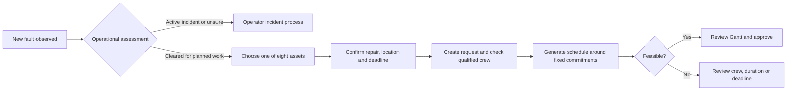

# Visual repair intake and schedule insertion

## Aim

Help a maintenance chief add a newly discovered, deferrable repair to the next engineering window while protecting approved routine work. The school-cover analogy is useful: fixed lessons correspond to approved maintenance commitments; a late staffing need corresponds to a corrective request that needs qualified people and an available slot.

This is planned corrective maintenance after operational assessment, not incident dispatch. Active flooding, an unsafe train or a live signalling failure belongs to the operator's incident process first. A subsequent pump, door or signal repair can enter this planning workflow. The prototype cannot decide whether an asset is safe to operate or safe to defer.

## Audit and decisions

- The description-first wizard still requires knowledge and typing before recognising an asset. Replace its entry with eight numbered asset choices and a labelled 2D train/infrastructure schematic.
- Use native buttons alongside the diagram so touch and keyboard users get the same choices. A rotating 3D model would conceal parts, require camera controls and imply a spatial model the repository does not have.
- Offer one editable catalog activity per shortcut; retain an Other path for free text. These are curated navigation shortcuts, not an evidence-based ranking of fault frequency.
- Preserve the explicit catalog choice in the backend. AI may assess free text, but must not silently replace the asset/activity the user selected.
- Show a separate, clearly synthetic worked example: approved preventive jobs remain fixed; the real solver either inserts the new repair or explains infeasibility. The example never writes to the live database.
- Live proposals keep approved and time-locked work fixed, but may move unapproved proposals. All new proposals still require planner approval.

## Verification

Check shortcut/catalog consistency, selection and draft persistence, no accidental creation, exact selected classification, solver-based fit and no-capacity cases, unchanged demo commitments, and zero demo job/audit writes. Inspect desktop and phone layouts with labelled controls and readable chart/table alternatives. Never use the user's key in automated tests.

Implemented and reviewed: 99 integration tests pass. The final 19 frontend cases and seven catalog/insertion cases pass after refinements. Desktop/phone inspection improved label contrast, header density, automatic titles and two-column touch controls. Real local example calls preserve both live jobs and audit history; the user's unsaved browser draft was cancelled. All demonstration timings and crew are explicitly synthetic.
