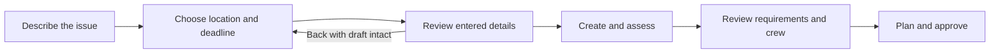
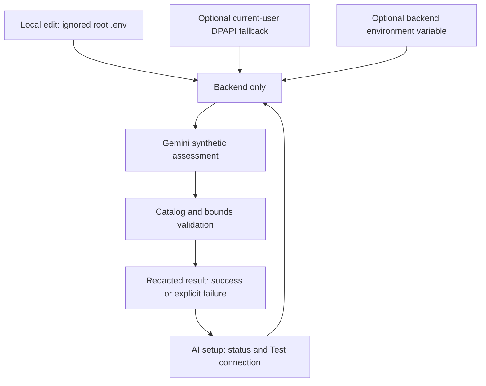

# Cockpit simplification and secure Gemini testing

17 September 2026. This pass responds to direct user feedback that the native UI still feels like a giant form and that the work-type list is overwhelming.

## Product decision

The maintenance chief should first see what needs a decision. The default destination becomes a cockpit with three readiness counts, a prioritized next action, and a clear **Add work** action. Detailed schedule review remains available when needed. Native widgets alone do not resolve information overload; the amount presented at one time must also change.

Adding work becomes a guided flow:

The full maintenance catalog is no longer the first question. Plain-language description is the default; category-first catalog selection and manual planning options are secondary. The review step describes entered information and defaults; AI assessment occurs after submission and is not presented as a prediction that has already run.

## Secure AI configuration

The user's subsequent preference is a root `.env` file, ignored by Git, with `GEMINI_API_KEY` and `GEMINI_MODEL=gemini-3.8-flash`. The backend reads it on demand; nonempty environment values take precedence. The earlier Windows current-user DPAPI helper remains an optional fallback. No HTTP route accepts or returns a key.

The UI shows separate states for **configured** and **tested successfully**. A dedicated test sends only synthetic maintenance text through the real Gemini assessment and domain-validation path, without creating a job. Missing credentials, provider failures and invalid model output cannot be reported as successful Gemini integration merely because rules provide a fallback.

## Coordination and acceptance

- GPT-5.6 backend agent: credential helper, configuration reader, safe status/test endpoints and setup instructions.
- GPT-5.6 frontend agent: cockpit, guided request draft, reduced navigation, AI status/testing UI.
- GPT-5.6 test agent: isolated credential/network mocks, secret-leak checks, wizard and chief journeys.
- Coordinating agent: review contracts and code, inspect real browser layouts, run integration checks, update reports, and run a live synthetic Gemini test once the user configures their key.

Acceptance requires draft retention across steps, clear defaults, no accidental duplicate creation, correct cockpit counts/actions, accurate current-job state, backend lifecycle guards, and distinguishable AI failures. Automated tests must never pick up a real local key. The existing live demonstration request remains unapproved unless the user asks to approve it.

## Implementation and review result

The cockpit, three-step wizard and AI setup/test routes are implemented. Coordinated review corrected Windows PowerShell assembly/module loading, strict model-output validation, engineering-window boundaries, advanced draft retention, utility navigation and a redundant draft-reset action. The final isolated suite passes 84 tests, including dynamic `.env` loading and Gemini 3.8 Flash model selection. Compilation and dependency checks pass.

Following the live provider failure, redacted status-specific error reporting was added and the suite expanded to 89 passing tests. Google AI Studio billing/quota remains the external condition preventing successful live generation.

The user subsequently resolved that condition. The live Gemini 3.8 Flash retry returned HTTP 200 and a validated Rail wear inspection assessment, with no changes to jobs or audit records. The live integration acceptance check is now satisfied.

Live browser review covered desktop flow and the 375-pixel review layout, including Back navigation and cancellation without creating a job. Existing requests were preserved. After local key setup, a live Gemini test returned HTTP 429 RESOURCE_EXHAUSTED with a billing-related error; successful generation remains pending resolution in Google AI Studio. Mock outcomes and a real Windows DPAPI dummy-key round trip have passed. See VALIDATION.md for evidence and limits.
