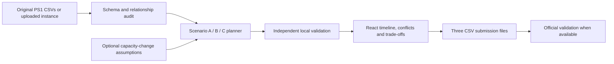

# PS1 dataset integration and React migration

## Acceptance criteria

The primary app must use the exact PS1 demand-book dataset from [the supplied repository](https://github.com/aochinwen/NebulaX-Hackathon-ProblemStatement/tree/main/PS1), pinned to commit `16526c02579c7f37e54eaaa42a4cc6d4ceb19994`. The instance contains eight CSV files, 14 contracts, 54 activities and a 30-week horizon. Its abstract Alpha/Beta topology must remain distinct from the legacy real-station reference and dummy engineer roster.

The planner must account for all workload and implement the published A/B/C policies, shared possession packing, complete location footprints, buffers, Live cross-bound/cross-line effects, allocation/workfront caps and ECLO limits. Exports use the three published submission schemas. Uploaded hidden instances and explainable capacity-change simulations must run through the same loader, planner and local validator.

The official validator is referenced but absent from the public repository. Independent local rule checks and tests will be implemented and labelled honestly. Official hidden-instance scoring cannot be claimed without that tool and its results.

## Coordinated implementation

1. **Dataset audit:** import original bytes, hash provenance, profile all tables, verify relationships and disclose ambiguities.
2. **Backend:** create a distinct PS1 instance model, planner and independent output validator; keep the existing corrective-work API and database intact.
3. **React:** make the access-planning cockpit primary, with progressive scenario selection, line/week timelines, clear rule results, data imports, downloads and an About page. Retain request/approval/execution as a separate workflow.
4. **Integration:** expose bounded asynchronous runs, isolate uploads, compare baseline and changed-capacity plans, serve the React build from FastAPI on one Render service.
5. **Verification loop:** test each hard-rule family, full demand coverage and A/B/C outputs; perform API and browser workflow checks at desktop and 375px; fix and rerun affected checks.
6. **Release:** update current entry-point documents and agent guidance; audit publication candidates; commit/push and verify the existing Render deployment and primary workflow.

Dataset ownership: GPT-5.6 dataset agent. Solver/validator ownership: GPT-5.6 backend agent. React ownership: GPT-5.6 UI agent. Root owns API integration, deployment, independent evaluation and final documentation.

## Design direction

The first design-skill search returned irrelevant wedding styling and was rejected. A narrowed enterprise analytics search returned dashboard filtering, blue data emphasis, amber exceptions, readable sans/monospace typography and accessible chart guidance. Apply those principles to Ngeebula's navy/teal operations identity; no marketing testimonials or decorative charts. Native HTML labels, visible focus, keyboard alternatives, exact-value tables and reduced-motion support are required.

