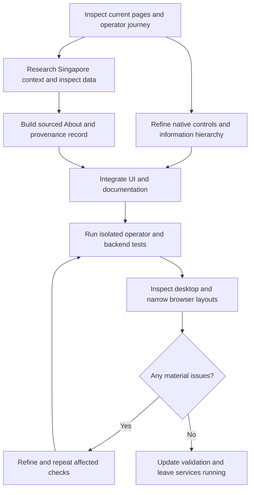

# Native Streamlit UX refinement

Requested and started 17 September 2026. Coordinating agent: GPT-6 Astra; supporting work: three GPT-5.6 Sol agents for interface implementation, research/About, and independent regression checks.

## Audit

The application already supports the complete request-to-execution journey. The remaining problem is how clearly operators can understand and navigate it.

| Finding | Effect on operators | Planned response |
|---|---|---|
| Custom HTML headings, cards and dense job tables duplicate native widgets | Inconsistent semantics, cramped text and fragile responsive styling | Native titles, bordered containers, metrics and dataframes; a small CSS layer only |
| Review and edit controls compete for attention | The next action is hard to identify | Clear section labels, task-focused navigation, progressive disclosure for overrides and settings |
| Large queues have no focused view | Operators must scan unrelated work | Explicit search/filter controls and accurate visible counts |
| Timeline emphasises bars but omits key time details in hover | Duration and available window are harder to judge | Familiar Gantt chart with SGT times, duration, status and a tabular alternative |
| About describes implementation without establishing the problem | Readers cannot assess the purpose or evidence | Singapore reporting, scoped problem statement, workflow, algorithm rationale and provenance |
| Supplied data is easily mistaken for operational records | Prototype results may be overinterpreted | Label verified examples, unverified origins and modeling assumptions separately |

The UI/UX skill's generated operations *landing-page* pattern does not fit this internal workspace. Its relevant contrast, focus, data readability and honest status guidance is used; marketing conversion sections are not adopted. Targeted form guidance supports visible labels and clear submission feedback. Streamlit is the detected stack; unrelated JavaScript stack recipes are not used.

## Work and review sequence

## Acceptance criteria

- Native Streamlit widgets carry page structure, input labels, feedback, summaries and tables.
- Operators can find a request, inspect requirements, generate a schedule, adjust it with a reason, approve it and record valid execution states.
- Selected records and editor values reflect the latest saved API state after scheduling and changes.
- Complex schedule information has a Gantt view and readable details; color is accompanied by text.
- About works without an API connection and explains scope, evidence, workflow, decisions, data provenance and limits without claiming measured benefits that were not evaluated.
- News links support the adjacent claims; the prototype's fixed window is not represented as an operator-wide fact.
- Automated checks use isolated data. Browser checks preserve the existing unapproved demonstration request.
- README, frontend guide, technology report and validation record describe the resulting system.

## Scope boundaries

This pass improves the interface and its explanation. Backend qualification, scheduling, approval and audit contracts remain authoritative. It does not introduce operational data feeds, authentication, a trained predictive model, or a production safety certification.

## Completion record

Implemented and reviewed on 17 September 2026. The integrated suite passed 60 cases; all six affected frontend cases passed after the responsive chart refinement. Actual browser inspection identified and corrected a stretched workflow diagram, truncated status text and crowded phone chart labels. Research citations, source-data uncertainty, architecture rationale and final checks are recorded in [RESEARCH_AND_DATA.md](../RESEARCH_AND_DATA.md), [TECH_STACK.md](../../TECH_STACK.md), [VALIDATION.md](../../VALIDATION.md) and [frontend/design-qa.md](../../frontend/design-qa.md). Both local services remain available for review.
