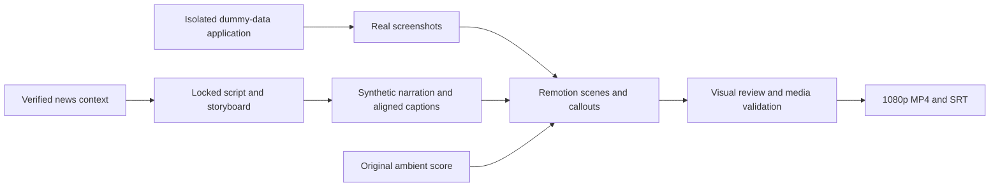

# Ngeebula stakeholder video

A 114-second promotional walkthrough, rendered at 1920 x 1080 and 30 fps. It combines actual Streamlit screenshots, original rail graphics, animated callouts, Singapore-English synthetic narration, an original ambient score and 40 burned-in English subtitle cues.

## Deliverables

- `out/ngeebula-stakeholder.mp4` — finished H.264/AAC video, generated locally and excluded from Git.
- `public/ngeebula-promo.en.srt` — separate subtitles for distribution.
- [Script and storyboard](../docs/video/SCRIPT_AND_STORYBOARD.md).
- [News sources and claim boundaries](../docs/video/SOURCES_AND_CLAIMS.md).
- [Screenshot capture notes](../docs/video/CAPTURE_NOTES.md).
- [Audio and caption QA](../docs/video/AUDIO_QA.md).
- [Final validation](../docs/video/VALIDATION.md).

## Preview and render

Use Node.js 22 or later. From this directory:

```powershell
npm ci
npm run dev
npm run lint
npm run render
```

Open the Studio URL printed by the command and choose `NgeebulaStakeholder`. The first render downloads Chrome Headless Shell. The checked-in screenshots, narration, score and captions make rendering independent of a running application or API credentials.

To regenerate the voice and score, install `edge-tts==7.2.8` and NumPy in a separate Python environment and put FFmpeg/FFprobe on PATH. Run `python scripts/prepare_video_audio.py` from the repository root. This calls Microsoft's online speech service with the public narration only; it uses no Gemini or Render key. The selected synthetic voice is `en-SG-WayneNeural`. Cached word timings stay in ignored `.run/video_audio/`. Voice regeneration can vary with the external service; committed audio is the reviewed version.

## Editorial scope

This is an animated screenshot walkthrough, not a screen recording of one submitted request. An unsaved intake draft is followed by prepared jobs in an isolated demo database. Names come from the owner's confirmed dummy roster. Neither filming nor narration tests changed live work. No real Gemini call is portrayed in the video.

The 1/2 to 2/2 comparison is one labelled synthetic solver case, not measured human performance or an operational benefit claim. News facts are attributed paraphrases; no publisher images, page screenshots, logos or footage are used. The rail animation and score are generated specifically for this video, without external samples. The closing screen states the prototype's scope.

## Structure



`src/scenes/` contains one component per scene; `src/Composition.tsx` controls transitions and audio. Frame-based interpolation keeps animations deterministic. Browser preview and output files are local tools and are not added to the Python Render service.

Remotion has its own [licensing terms](https://github.com/remotion-dev/remotion/blob/main/LICENSE.md); this project does not assign a new licence to the application.
